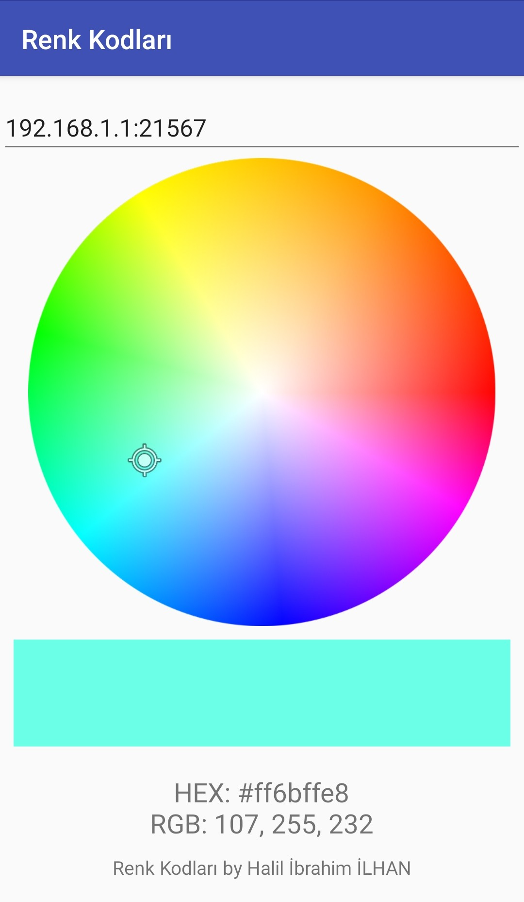
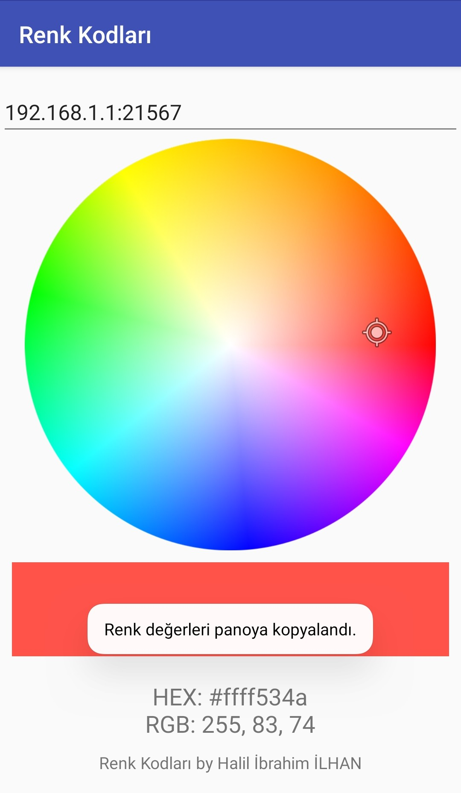

# RenkKodlari Color Picker App (IOT-ESP32-RGB-Led-Controller)
-Android app picks a color from color wheel and converts it to hex and rgb color values then sends to Esp32 board via wifi for controlling rgb led.

some specs:

-touch tracker on color Wheel

-copies to clipboard the color values on long click to text of color values 

-send color values to Esp32 IOT card with Tcp over wifi

# Screen Views

  
